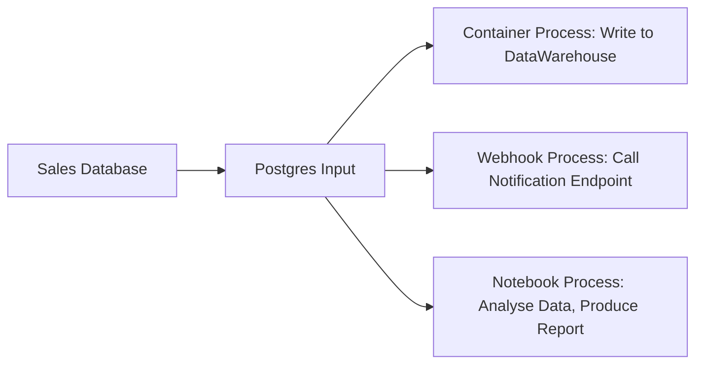

# Webhooks Example

This directory contains an example of how the webhooks input and process might be used.

It contains both an input and a process, which are linked together, so that when the webhook input is hit, the process is called which then sends the event on.

In many respects what we have in this example is a proxy for events- which... fine.

You, of course, are free to not do that- this is just an example.

You might build the pipeline:



Where the webhook process as defined in this package is used to call some arbitrary endpoint.


## Usage

This example uses the dead standard go toolchain:

```bash
$ go build
$ ./example
```

Additionally, the endpoint this example sends events to can be specified in the environment:

```bash
$ WEBHOOKS_DESTINATION=https://example.com/blah
$ ./example
```

(Tools such as https://webhook.site can be used, for instance, to see the returned payload)

To trigger the input, and thus the process, simply run:

```bash
$ curl -H 'content-type: application/json' -XPOST -d '{"location":"thingy","operation":"create","id":"0xabadbabe"}' 127.0.1.1:8888/webhooks/webhooks-input-example
```
